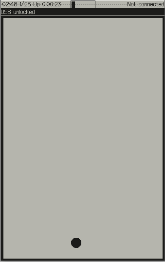

# Ball

A simple demo application that mainly demonstrates how to integrate into the Xous framework,
but without much emphasis on I/O.

A ball bounces around, changing directions randomly whenever it hits a border. Pressing
any key will pop up a modal dialog box that informs you of the key pressed, and then
gives you an option to change the behavior into a "tilt" driven mode where the gyro
is read and used to control the ball's motion.

This is a fairly "raw iron" demo, and would be a reasonable starting point for someone who,
for example, wants to write a video game.
## Copying This App

1. Copy this demo application, and rename the relevant structures in its `Cargo.toml` and `main.rs`.
2. Add it to the Workspace `default-members` and `members` arrays by editing `./Cargo.toml`
3. Edit the `manifest.json` file as documented in its [README](../README.md)
4. Build using `cargo xtask app-image you_new_app` to create a flashable Xous image with your app in it.