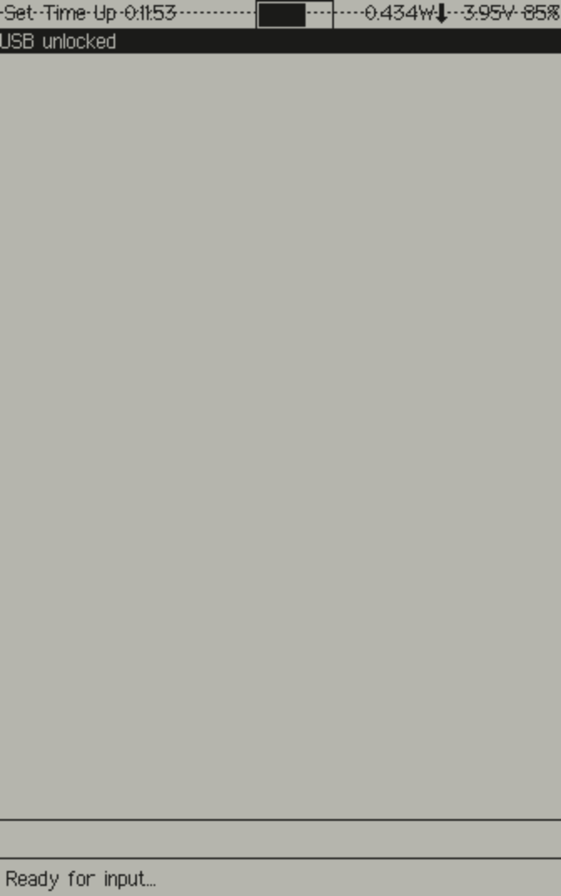
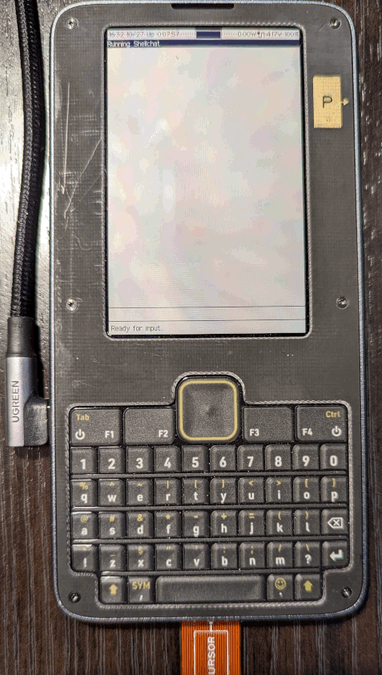
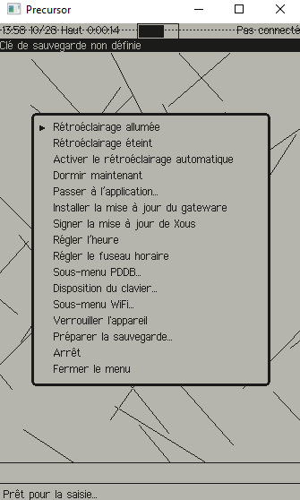

# mtxcli

This is a simple Matrix chat application.

Here you see **mtxcli** running in hosted mode:

```
cargo xtask run mtxcli
```



## Background

This is a simple [Matrix chat](https://matrix.org/) application based on the REPL framework and adapted from the Desktop project [mtxcli](https://github.com/betrusted-io/mtxcli)

## Setup

In order to simplify the **mtxcli** application as much as possible the following
must be setup on a conventional device before using Betrusted (laptop, mobile phone).

* Create a new Matrix user (if needed):
  * https://matrix.org/faq/#how-do-i-get-an-account-and-get-started%3F
  * https://matrix.org/docs/projects/try-matrix-now/
* Find (or create) a new room to join for chatting:
  * https://doc.matrix.tu-dresden.de/en/rooms/create/
  * https://spec.matrix.org/latest/#room-structure
* Join the room
* Save the configuration in the pddb
  * `/set user @myname:matrix.org`
  * `/set password MySecret`
  * `/set room #my-chat-room`

## Commands

The following commands are available in **mtxcli**:
* `/help [cmd]` -- shows help message for all commands (or one cmd if given)
* `/login` -- logs in to the server (assumes user and password are set)
* `/logout` -- logs out of the server
* `/get key` -- shows value of key (from the PDDB)
* `/set key value` -- sets value of key (in the PDDB)
* `/unset key` -- removes key (from the PDDB)
* `/status` -- shows status of the connection

## Chatting

Any line not starting with a slash ('/') will be sent to the current room.
New messages from the current room will be displayed.

## mtxcli on the Precursor device

Here are some images of runing **mtxcli** on the Precursor.
_NOTE_: this Precusor has the [Pi HAT](https://github.com/betrusted-io/betrusted-wiki/wiki/Updates-for-Advanced-Users#failsafe-method) installed.



## mtxcli in French

I recently added the French localization to Xous -- including
translating all of **mtxcli**. For more about locales and
Xous please see the [locales README](https://github.com/betrusted-io/xous-core/blob/main/locales/README.md)



## Troubleshooting

Prequisites: it is essential that the PDDB is mounted and WiFi is
connected before running mtxcli. You can verify these in Shellchat
with `net ping 1.1.1.1`.

If you see the message `WARNING: clock not set` that is likely because
the Precursor real time clock needs to be set (e.g. if the battery
has been completely discharged). Please go to the menu
**Preferences | Set Timezone** to set the time zone
(and update the time via NTP).

If you see the message `authentication failed` it might be because
the `user` and `password` variables are not set properly.
Alternatively it could be because TLS certificate validation
has failed because the clock has not been set (see above).

## Acknowledgements

This app is supported in part by a grant from the
[NGI0 PET Fund](https://nlnet.nl/PET/),
a fund established by NLnet with financial support from the
European Commission's [Next Generation Internet](https://www.ngi.eu/) program.


