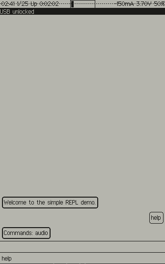

# MTXCLI

This is a new Matrix chat application which will be derived from REPL.

## Background

This is a simple [Matrix chat](https://matrix.org/) application based on the REPL framework.

## Setup

In order to simplify the **mtxcli** application as much as possible the following
must be setup on a conventional device before using Betrusted (laptop, mobile phone).

* Create a new Matrix user:
  * https://matrix.org/faq/#how-do-i-get-an-account-and-get-started%3F
* Find (or create) a new room to join for chatting:
  * https://doc.matrix.tu-dresden.de/en/rooms/create/
  * https://spec.matrix.org/latest/#room-structure
* Join the room
* Save the configuration in the pddb
  * `/set user @myname:matrix.org`
  * `/set password AbigSecret`
  * `/set room #my-chat-room`

## Commands

The following commands are available in **mtxcli**:
* `/help [cmd]` -- shows help message for all commands (or one cmd if given)
* `/get key` -- shows value of key (from the PDDB)
* `/set key value` -- sets value of key (in the PDDB)
* `/unset key` -- removes key (from the PDDB)
* `/status` -- shows status of the connection

## Chatting

Any line not starting with a slash ('/') will be sent to the current room.
New messages from the current room will be displayed.

_NOTE:_ chatting is not implemented yet
