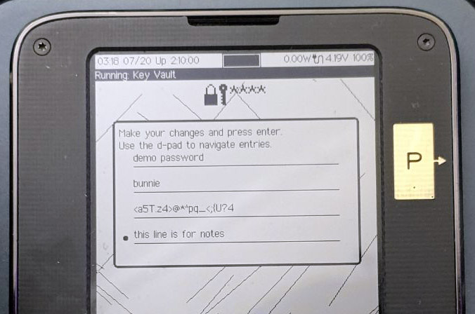

# Vault App

The Vault app can manage U2F/FIDO2, TOTP, and conventional passwords, all from a single UX, and in a plausibly deniable manner.

When the Vault app is launched, you can plug your Precursor into a host PC, and use it as a U2F or FIDO2 authentication token. Unlike a typical security key, you can see a description of what you’re authenticating:

You can also see the list of U2F credentials that are stored inside your device:

You can use the `F1`-`F3` hot keys below the screen to switch between Vault modes. `F2` brings you to the TOTP mode:

And `F3` brings you to the classic password manager:

In each of these modes, you can select and edit the credentials on the device, like so:

Here, you can see how each password record has a descriptive name (“demo password”), the username (“bunnie”), the password itself, and a note field where I can keep track of any special characteristics for the password (“this line is for notes”).

The password manager can also help you create a strong password with the help of Precursor’s built-in TRNG. It has basic configuration options for things like the length of the password, and if the password should include symbols, numbers, and/or upper case characters.

The Vault also features “Autotype”: if your device is connected to your host via USB, it will appear as a keyboard when the Vault app is active. Precursor can then send virtual key-strokes to automatically fill in a password or OTP with the push of a button. This way, you never actually have to see or type any passwords yourself; so long as you have your Precursor plugged into the host machine, your passwords are just a couple button presses away.

You can also see from this menu that “secret bases” (bases being the plural of basis) are explicitly supported by the Vault app, thanks to the [Plausibly Deniable DataBase](https://www.bunniestudios.com/blog/?p=6307) (PDDB) built into Xous. The structure of the PDDB is a subject for a whole other post, but in a nutshell secret bases are database overlays that can hide credentials in a plausibly deniable fashion. By keeping sensitive credentials in a secret basis, you can safely share only the credentials that are currently visible with friends, colleagues, or even law enforcement. The locked credentials are untraceable: even if a full forensic dump is made of the device’s contents without your permission, it is hard to prove the existence or non-existence of secrets beyond the ones you have chosen to reveal to the party in possession of your device. To this end, the "Unlock secret Basis" menu item is _always_ present, even if there are no secret bases on the device.

## Backups

Of course, a cautious user would hesitate to put all their passwords into a single device without backups. For those users: Good news! In this release, we also have a solution for backups. There is now a new main menu item titled “Prepare for Backup…” which extracts your root keys, encrypts them, and stages them with the PDDB for readout by a host via USB. You can read about how to do [backups and restores at our wiki](https://github.com/betrusted-io/betrusted-wiki/wiki/Backups).

The backup key is the 256-bit AES key encrypts your FPGA, and transitively your root key store. When you perform a backup, the backup key is displayed on your screen as a BIP-39 wordlist:

We also have created a BIP-39 wordlist input helper, so you don’t actually have to type every word in full – the helper will offer autocomplete suggestions.

As most developers have not set their backup key, the key by default would show as “abandon abandon abandon … art” (That is, 256 zeroes in BIP-39 format), but users who wish to set a strong backup key can currently follow [this guide](https://github.com/betrusted-io/betrusted-wiki/wiki/FAQ:-FPGA-AES-Encryption-Key-(eFuse-BBRAM)#how-do-i-externally-provision-my-device) to “burn” their BBRAM FPGA key with the help of a Raspberry Pi. We plan to unlock fully self-contained burning of the eFuse key in the next release or two. However, we’d like to put this flow through more testing first, because once the eFuse key is burned, you can’t undo it, and the device is permanently bricked if something goes wrong!