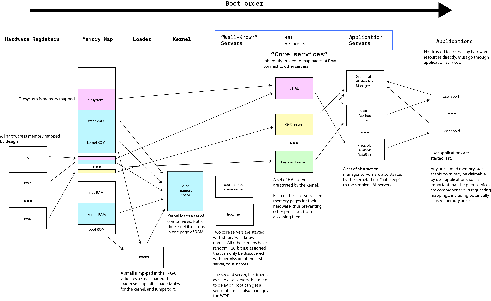

# Xous Services

Xous is a microkernel OS. The kernel itself is a small program, which runs within just one 4kiB page of RAM. The kernel in and of itself hands out pages from the page table, and routes messages. Everything else is managed by "servers".

Interprocess messages are fast and light-weight in Xous. `Scalar` messages pass data using registers on the stack, and are the fastest messages. `Memory` messages work by remapping memory pages between processes. `send`, `lend`, and `lend_mut` of memory pages is supported. `send` creates a full copy of the page, and is non-blocking; `lend` remaps the page into the borrowing process with read-only privileges, blocking the lending process until the borrowing process returns the page. `lend_mut` is like `lend` but with read/write privileges allowed on the lent memory.

The underlaying hardware is entirely memory-mapped; this includes the notional "disk" which is actually FLASH ROM. Every hardware peripheral has its addresses page-aligned, so that individual peripherals may be "owned" by a given server. The kernel itself "owns" no hardware other than a UART for debugging and a private port into the TRNG.

The kernel starts up a core set of servers, which are broadly divided into three categories:

- "Well known" servers
- "HAL" servers
- "Application" servers

Almost all servers in xous are accessed through a 128-bit, cryptographically random `SID`. These random IDs change with every boot. Thus, in order to connect to a server, one must first resolve its name into an `SID`. In order to facilitate this process, three "well known" servers are provided:

- `xous-names`
- `ticktimer-server`
- `log-server`

These three servers can be accessed by any process, regardless of their trust level, as their `SID` is actually a well-known number. The `ticktimer-server` is well-known so that servers can delay their boot (if necessary; so far it hasn't been). The `log-server` is well-known so that errors in connecting to the name server can be debugged.Please refer to the [README for xous-names](xous-names/README.md) for more details on how name resolution works.

Initially, `xous-names` functions as a permissive oracle that allows kernel servers to freely look up `SID`s using the set of names defined in [names.rs](../xous-rs/src/names.rs). Once the kernel is initialized, a `lockdown` message is sent to `xous-names` which prevents any further lookups on servers that are meant to be private to the kernel. (*TODO*: a coherent, maintainable method for declaring private servers to `xous-names`)

The distinction between "HAL" servers and "Application" servers is fuzzy; but as a rule of thumb, "HAL" servers are private to the kernel and strive for minimal complexity and maximal clarity in their writing. "Application" servers remain discoverable by user applications after the `lockdown` event, and are responsible for gate-keeping and vetting requests to the HAL layer.

An example of this is the `graphics-server` and the `gam`.

The `graphics-server` is a HAL; any process that can talk to it is capable of drawing pixels on the screen at any location. The `graphics-server` implements drawing primitives like `Rectangle`, `Line`, `Circle`, and `TextView`, as message-passing at the pixel level would not be performant. User processes should not be allowed to talk to it, because it would allow user processes to create a fake UI and thus could fool users into typing passwords into fake dialog boxes.

The `gam` is a Graphical Abstraction Manager. It manages various `Canvas` objects that have trust levels associated with them. Primitives such as `TextView` are bound to `Canvas` objects, and the `gam` will handle vetting if the objects are allowed to be drawn, clipping, and so forth. Note that the Xous philosophy is that applications do _not_ get to control the exact look-and-feel of their UI; this is to prevent less trusted applications from masquerading as trusted applications, but also assists with things like accessibility and internationalization. For example, applications cannot pick their font; they can only request a style class such as "small", "regular", and "bold". Thus application developers should think of rendering their UI more as hints and directives to the `gam`, and less as direct pixel pushing.

Conceptually, a complete Xous OS implementation would have HALs that claim the pages of every hardware device, and application servers that claim all the other remaining memory pages -- this includes unused pages and aliased regions -- except for the free memory reserved for applications themselves. Thus, Xous as a kernel does nothing to prevent anyone on its own right from mapping a page; it's up to the complete set of services frameworks to ensure that all the requisite pages have been mapped. (*TODO*: an audit tool to check the memory space and verify that 1. all CSRs and memory spaces explicitly declared in soc.svd are mapped, and 2. checks that otherwise remaining free space is mapped to a "gutter" that panics if accessed).

We're trying to track progress on implementing the various servers using [github projects](https://github.com/betrusted-io/xous-core/projects/1).

## Server Limit

Xous is currently limited to 128 servers. Each potential server reserves 40 bytes of space in the kernel. Xous 0.8 carries about 30 servers, so 128 servers should be reasonably future-proof. Adjusting the limit requires making a change in two places (note the permalink is to an older version of Xous):

1. https://github.com/betrusted-io/xous-core/blob/68aff967e85847cce98e6ec65384f59c803f18a8/kernel/src/services.rs#L19
1. https://github.com/betrusted-io/xous-core/blob/68aff967e85847cce98e6ec65384f59c803f18a8/kernel/src/services.rs#L235

Process count is adjusted by altering https://github.com/betrusted-io/xous-core/blob/master/kernel/src/arch/riscv/process.rs#L15. Xous 0.8 carries about 10 processes, and the current limit is 63. Each additional process reserves about 16 or so additional bytes for tracking information.

## Well-Known Servers
Here is the list of well-known services:
- `ticktimer-server` -- allows processes to know elapsed time since start, and request sleeps. Also manages WDT.
- `xous-names` -- resolves names into `SID`s.
- `log-server` -- implements info and error logging. Has a separate UART from the kernel UART.

## Hal Servers
Here are a list of HALs, implemented and projected, and their functions:

- `com` -- manages requests to and from the EC
- `graphics-server` -- manages the frame buffer and basic drawing primitives. Talks to the MEMLCD
- `keyboard` -- key matrix management; debounce; ScanCode conversion. Keyboard layouts (qwerty, dvorak, azerty, qwertz, braille) are interpreted in this server
- `trng` -- manages the TRNG hardware, provides TRNGs for other processes
- `llio` -- manages I2C, RTC, GPIO, pin interrupts, soft reboot, and power pins. Also home for info, build IDs, etc.
- `codec` -- basic buffering of frames into and out of the audio CODEC
- `jtag` -- manages the JTAG interface (used for key fusing)
- `keys` -- management of cryptographic key store
- `engine25519` -- Engine25519 interface
- `sha512` -- SHA512 interface
- `spinor` -- manages the erasure and programming of the SPINOR
- `ram` -- manages allocation of RAM for applications
- `scheduler` -- manages thread scheduling and priorities

## Application Servers
Here are a list of application servers, implemented and projected, and their functions:
- `fcc-agent` -- use-once -- a special agent meant to run on a minimal Xous for FCC testing. Should never be compiled into production firmware.
- `trng-tester` -- use-once -- a special server used to facilitate testing of the TRNG. Pipes TRNG output to memory regions that can be read out using `bt-rngd` and fed into Dieharder for analysis.
- `gam` -- pre-alpha -- manages `Canvas` objects, and provides an abstract framework for applications. Also manages status bar, context menus and pop-up notifications.
- `ime` -- liases with `keyboard` and `gam` to handle keyboard input
- `pddb` -- plausibly deniable database. Used in lieu of a conventional filesystem for storing key/value pairs in a plausibly deniable fashion.
- `update-ec` -- manages the updating of the EC
- `update-soc` -- manages remote (non-USB) updates of the FPGA and kernel
- `net` -- manages connections to the Internet
- `wifi` -- manages wifi configuration
- `power` -- intermediates requests to the backlight, battery status, charging, RTC, etc.
- `accel` -- intermediates requests to the accelerometer
- `audio` -- intermediates requests to the audio hardware. Does stream mixing, etc.
- `usb` -- handles USB connections
- `credentials` -- trusted PIN/password entry mechanism, manages currently activated credentials

## Applications
Here are a list of user applications:
- `shell` -- refactoring -- provides a "chat-like" interface for talking to Xous
- `chat` -- text and audio secure chat app
- `launcher` -- an application launcher
- `password` -- a password vault
