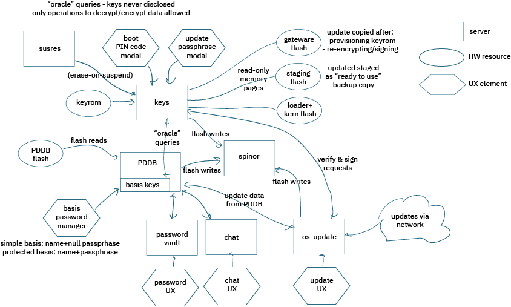

# Keys

This is the manager for the root keys. It also attempts to manage all the secure elements that could modify or access the root keys through indirect channels.

## Background
An alternate approach that was considered, but not adopted, was to break update capabilities out of the `keys` block into their own
separate servers. The argument for this approach was to reduce the complexity within the `keys` block to make it easier to analyze.
The downside is that it introduces more inter-process communications of sensitive data. In particular, any process that can access the gateware (that is, the FPGA bitstream) effectively has access to the `keys`, as they are encoded within the bitstream for the FPGA. Thus while this would essentially reduce the complexity of the `keys` server, it greatly expands the attack surface.

In the end, we are starting with an approach where all of the OS-sensitive boot memory is mapped into the `keys` process space. Mapping them into the `keys` process space inherently denies any other server the ability to access them, but it also makes `keys` responsible for doing things like checking & generating signatures, and re-encrypting bitstreams. It also means that `keys` grows a minimal amount of UX code, that is, the code necessary to collect passwords.

## UX

It was decided that the password UX code for `keys` is going to be a minimalist modal dialogue box, and the number of passwords will be limited to two: one for unlocking a set of keys related to user data, and one for unlocking a set of keys related to OS updates.

Rationale:
 - We do not want to overwhelm users with too many passwords
 - Gateware/OS updates are security-critical. A compromised FPGA image destroys all trust. Its passphrase should be strong, but entered infrequently.
 - User data needs to be unlocked at every boot. Compromising the user unlock password in itself doesn't lead to an immediate compromise of downstream secrets, thanks to the layered-password model of the PDDB basis keys. Thus, users with moderate-to-light risk profiles could be better served with a simple PIN code to unlock the user data after a boot.
 - Downstream passwords should exist outside of `keys`. `keys` should be considered just a root that manages more ephemeral keys that are stored in FLASH.
 - The UX function is closely bonded into the `keys` server so as to minimize the amount of code that touches sensitive user password data.

## Context

Above is a notional diagram that illustrates the relationship between the various servers involved in cryptographic matters.

This server, `keys`, has the following responsibilities:
 - Maps the KEYROM hardware block, preventing other processes from reading it
 - Responds to "oracle" style queries, which never disclose a key from the KEYROM; it can:
    - encrypt requested data
    - decrypt requested data
    - sign a data block
 - It communicates with the TRNG to provision and create keys if the KEYROM is initially blank
 - It communicates with `xous_names` to confirm that the system has fully booted and that all servers with limited connection slots have their connections filled prior to allowing any sensitive operations.
 - Manages the state of the two unlock passwords for the KEYROM
   - Boot PIN code: secures the root application keys
   - Update passphrase: secures updates
   - The passwords are prompted automatically by `keys` as a result of third-party API calls requesting services of `keys` that would require their entry.
   - Passwords are hashed with `bcrypt` prior to use. In line with [OWASP](https://cheatsheetseries.owasp.org/cheatsheets/Password_Storage_Cheat_Sheet.html) reccommendations, we opt to use the older, battle-tested `bcrypt` algorithm because the limited memory of Precursor does not allow us to use other algorithms with parameters that impart substantial security advantages.
   - The passwords are entered via simple pop-up modal dialog boxes that plug directly into the `keys` memory space
 - Listens to the susres server to enforce password retirement policies
   - Plaintext copies of the password are mapped into a deliberate page of memory that is zero-ized on `Drop`, `suspend`, or other system states depending upon user policy.
 - Maps the regions of ROM that contain the gateware (SoC bitstream), loader (except font planes), and kernel. This effectively keeps other processes from reading these spaces.
   - Note that the font planes, which are part of the loader, are mapped into the `gfx-server` memory space for computational efficiency reasons.
   - This does make verifying the loader a bit more complicated as it requires assistance and trust of the `gfx-server`, and it means that an attacker could potentially spoof the font map.
 - Claims the "SoC" token on the `spinor` server, which gives it exclusive access to write to the sensitive gateware area.
   - Note that the `keys` can allow access for third-party process to write to the `staging` area, so that another program can handle acquiring the update data (but it can also revoke access once the image has been submitted for verification).
   - Also, any process can write the kernel and loader area, but this is "okay" because the digital signature check should hamper attempts to patch and modify these regions without authorization.
 - Prepares gateware that is staged for updating
   - Injects a copy of the `KEYROM` into the staged bitstream
   - Re-encrypts the gateware to the local eFuse or BBRAM key, if any
   - Adds digital signatures to the blocks if self-signing is enabled
   - Validates the staged gateware for integrity (decrypt & HMAC check)
   - Copies the prepared gateware to the "live" location, once validated
 - Generates & writes self-signing loader and xous signatures

Shortcomings:
 - Anyone can attempt to initiate an update by calling the library API on `keys`. However, the update can not proceed without user consent via password.
 - Fonts are mapped into the `gfx-server` memory space, which complicates loader.bin verification and validation. It also creates a potential for exploits that swap out fonts to create false messages to users.
 - There's a lot of complexity in this server, which makes it harder to analyze; see "Background" section above, for a discussion of the trade-offs that lead to this decision.

