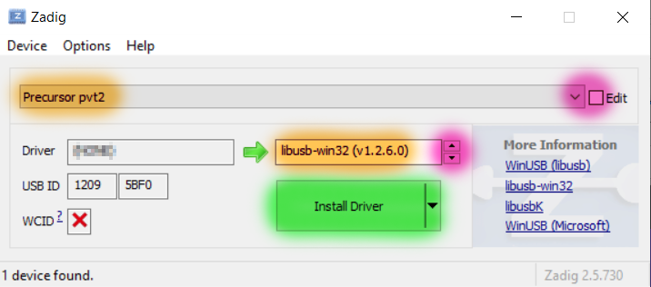

# Tools

## usb_update.py

`usb_update.py` is the script for copying firmware packages from a host onto a Precursor device.

### Installation: Linux (Ubuntu/Debian)

* `sudo pip3 install pyusb progressbar2` (you need `pyusb` and `progressbar2` in the sudo environment)
* you probably need to run as `sudo`: `sudo ./usb_update.py [args]` to access the USB port; add the appropriate command line arguments

If you don't like/can't use `sudo`, I hear something involving udev can solve this problem, but I've never been able to get it to work. If someone can contribute a simple, robust cross-distro guide to USB `udev` rules that ages well, I'm guessing the Internet would appreciate it.

### Installation: Windows 10

* You will need to install python3 from the Windows App store
* Run `pip3 install pyusb progressbar2 [args]` from a Powershell
* use [zadig](https://zadig.akeo.ie/) to remap `Precursor pvt2`'s Windows driver to `libusb-win32`
* Run `python3 .\usb_update.py [args]` from a Powershell; elevated privs are not necessary after using `zadig`.



### Installation: iOS

We have no experience with iOS, nor do we own any modern Apple machines. In short, we have no idea
how to iOS.

I hear it's popular with the cool kids in Silicon Valley. If someone can contribute a guide that'd be great.

### Performance Note

Systems using an AMD Ryzen chipset run about 5x
slower than others (e.g. Raspberry Pi, Intel chipsets). This holds true across Linux/Windows OS. The
effect has been confirmed on both B450 and B550 Socket AM4 motherboards. It seems to be linked with
full-speed packet rates being throttled on AMD motherboards by the chipset, but TBD. Write speed is
~8.5kiB/s on AMD, vs ~44kiB/s on Raspberry Pi.

### Usage

`usb_update.py` works with Precursor devices that have Xous 0.8 or 0.9. Later releases may work,
but check the release notes.

The updater encodes the offsets of every binary location in the script. When these locations shift,
then the updater script should no longer be used for a given Precursor revision.

```
usage: usb_update.py [-h] [-s [SoC gateware file]] [-l [loader file]] [-k [kernel file]] [-e [EC gateware package]]
                     [-w [WF200 firmware package]] [--peek ADDR] [--poke ADDR DATA] [--check-poke] [--config]

Update/upload to a Precursor device running Xous 0.8/0.9

optional arguments:
  -h, --help            show this help message and exit
  -s [SoC gateware file], --soc [SoC gateware file]
                        SoC gateware
  -l [loader file], --loader [loader file]
                        Loader
  -k [kernel file], --kernel [kernel file]
                        Kernel
  -e [EC gateware package], --ec [EC gateware package]
                        EC gateware
  -w [WF200 firmware package], --wf200 [WF200 firmware package]
                        WF200 firmware
  --peek ADDR           Inspect an address
  --poke ADDR DATA      Write to an address
  --check-poke          Read data before and after the poke
  --config              Print the descriptor
```

You can try reading the first word out of the ROM to see if `usb_update.py` is working correctly.
It's located at 0x20000000, and it's always `0x665599aa` (this is the Xilinx FPGA bitstream sync word),
as follows:

```
% python3 ./usb_update.py --peek 0x20000000
0x665599aa
```

